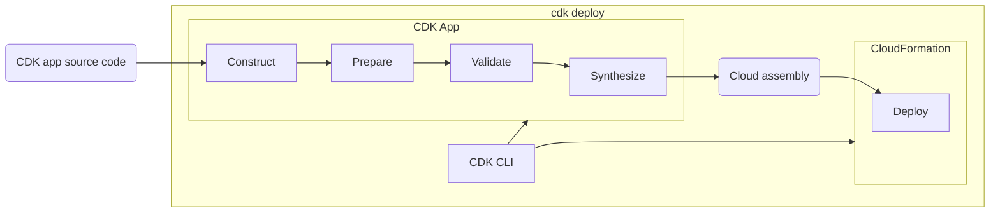
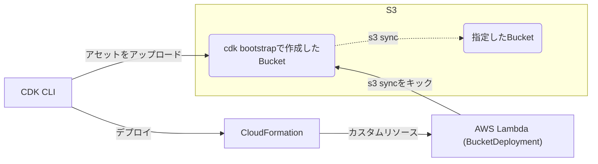
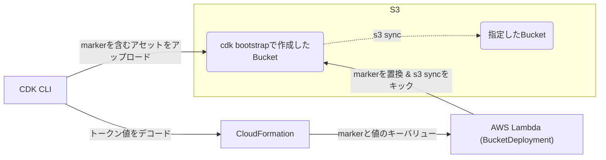

---
# try also 'default' to start simple
# theme: seriph
# random image from a curated Unsplash collection by Anthony
# like them? see https://unsplash.com/collections/94734566/slidev
background: https://source.unsplash.com/collection/94734566/1920x1080
# apply any windi css classes to the current slide
class: 'text-center'
# https://sli.dev/custom/highlighters.html
highlighter: shiki
# show line numbers in code blocks
lineNumbers: true
# some information about the slides, markdown enabled
# info: |
#   ## CDK支部 #4 s3-deployment
# persist drawings in exports and build
drawings:
  persist: false
# use UnoCSS
# css: unocss
colorSchema: 'dark'
fonts:
  sans: 'メイリオ'
  serif: 'メイリオ'
  mono: 'Inconsolata'
hideInToc: true
---

# s3-deploymentで解決するデプロイ時の値

<!--
皆さんこんにちはゆっきーです。
私のセッションは2022年にアップデートされたs3-deploymentモジュールの説明です。
-->

---
hideInToc: true
layout: intro
---

# 自己紹介

<br>
<div class="flex opacity-90">
  <div class="basis-1/4">
    <div  class="rounded-full h-40 w-40 mx-auto" style="background-color: #6CBDCD">
      
    </div>
    <div class="py-3 text-center">
      <div class="text-4xl font-bold">吉川 幸弘</div>
      <div class="pt-1 text-2xl opacity-80">@WinterYukky</div>
    </div>
    <div class="flex justify-around px-5">
      <a href="https://github.com/WinterYukky" target="_blank" alt="GitHub" class="text-xl icon-btn opacity-50 !border-none !hover:text-white">
        <mdi-github class="text-3xl" />
      </a>
      <a href="https://twitter.com/WinterYukky" target="_blank" alt="Twitter" class="text-xl icon-btn opacity-50 !border-none !hover:text-sky-500">
        <mdi-twitter class="text-3xl text-sky-500" />
      </a>
    </div>
  </div>
  <div class="basis-3/4 pl-10 flex h-100 align-center">
    <ul class="text-2xl">
      <li>アマゾン ウェブ サービス ジャパン合同会社
        <ul class="text-2xl">
          <li>西日本担当ソリューションアーキテクト</li>
        </ul>
      </li>
      <li>AWS CDK💖</li>
    </ul>
  </div>
</div>

<!-- 
まず自己紹介からさせてください。
わたくしは吉川 幸弘 と申します。
今年このCDK支部を佐藤さんらと共に設立し、その後もAWSと関わってお仕事をしていきたいということでアマゾンウェブサービスジャパン合同会社へ入社致しました。
現在は西日本のお客様を対象に、ソリューションアーキテクトとして活動させていただいております。
CDK支部の皆さんと話し合い、CDK支部の活動はAWS入社後も皆さんのサポートをさせていただくことで続ける形にいたしました。
では、発表に入っていきましょう。こちらがアジェンダです。
 -->

---
hideInToc: true
---

# アジェンダ

<br><br><br>

- cdk deployの流れ
- デプロイ時の値を解決してデプロイする関数
- 余談

---

# cdk deployの流れ

<br><br><br>



<br>
<div v-click class="text-xl">

Cloud assembly：CFnテンプレート + アセット

アセット：アプリケーションコードやDockerイメージアセット

</div>

<!-- 
まずs3-deploymentについて説明する前に簡単に「cdk deploy」の流れについて説明します。
これはawsの公式ドキュメントに載っている「cdk deploy」を呼び出す時にCDKが通過するフェーズを示しています。
CDK Appは実行するとCloud assemblyと呼ばれるアーティファクトを出力し、そのCloud assemblyをAWSへデプロイすることでリソースが作成されます。
このCloud assemblyというものを初めて聞かれる方は、新しいファイル形式か何かかと思われるかもしれません。
実際はそんなことはなく、いわゆるCloudFormationテンプレートとアセットのことを指します。
アセットとはAWS Lambdaのアプリケーションコードや、dockerイメージアセットなどのことを指します。
-->
---

# s3-deploymentとは 
※Source.asset()の場合

<br><br>



<br>
<div v-click class="text-xl">

⇒ asset()の場合、アセットはデプロイ時の値を利用できない

</div>

<!-- 
そのアセットを任意のS3バケットへデプロイする機能を提供しているのがs3-deploymentです。
私個人もcdkを利用して静的ウェブサイトを配信するためによく利用しています。 

そんな便利なs3-deploymentですが、dataが実装される以前はデプロイ時の値を利用できないという欠点がありました。デプロイ時の値というと初めての方はいまいちピンとこないかもしれません。

デプロイ時の値というのは、例えばCloudFrontディストリビューションのランダムに決定されるドメイン名等を指します。これらの値はデプロイして初めて決定する値であり、事前に認識することはできません。
もちろん、ドメイン名であれば皆さんが管理されているドメインを利用することがほとんどでしょうから、ドメイン名でこの問題が発生することは少ないかと思います。あくまでイメージしやすい例として捉えていただければ幸いです。
-->

---

# もう一度cdk deployの流れ

<br><br><br>


<br>
<ul v-click>
  <li>「Synthesize」フェーズではデプロイ時の実際の値は取得できない
    <ul>
      <li>アセットはデプロイ時の値は利用できない</li>
    </ul>
  </li>
</ul>

<!--
先ほど説明した「cdk deploy」の流れについて、もう一度説明したいと思います。
今回重要なのは「Synthesize」と「Deploy」のフェーズです。見ていただくと分かるように「Synthesize」のフェーズの終了と同時にCDK Appの実行が終了しています。
それは即ちCDK App内でCloudFront ディストリビューションのドメイン名のようなデプロイ時の値を直接利用できないということです。
-->

---
layout: center
---

## 実際の値が取得できない≠デプロイ時の値が利用できない

---

# Tokenについて

```ts {all|1-2|4-5|none}
declare const distribution: cloudfront.Distribution;
const url = `https://${distribution.domainName}`;

// https://${Token[TOKEN.362]}
console.log(url);
```

```yaml {none|4-9}
Outputs:
  URL:
    Value:
      Fn::Join:
        - ""
        - - https://
          - Fn::GetAtt:
              - Distribution830FAC52
              - DomainName
```

<br>

- CDK内でデプロイ時の値はTokenとして扱える
- TokenはSynth時にCloudFormationテンプレート組み込み関数等にデコードされる

<!-- 
実際のところは利用できないわけではなく、CDK App内ではこうした実行時に認識できない値をTokenという値として処理しています。
試しにCDKアプリ内で`https://${distribution.domainName}`といった文字列を出力するとhttps://Tokenと出力されます。
CloudFormation Template内では次のように処理されます。

このようになっているため私たちはCDKでコードを書く時にデプロイ時の値を意識することなく利用できるのです。
しかしながら、これはCloudFormation内の話であって先ほどのようにデプロイ時の値をファイルに書き出して、それをs3-deploymentでデプロイしてもそのままToken値としてデプロイされてしまします。
 -->

---

# デプロイ時の値を解決してデプロイする関数

<div class="grid grid-cols-2 gap-8 h-100">
  <div class="rounded-2xl bg-white/10 flex justify-center items-center text-4xl">
    Source.data()
  </div>
  <div class="rounded-2xl bg-white/10 flex justify-center items-center text-4xl">
    Source.jsonData()
  </div>
</div>

<!-- 
この時に利用できるのがdata()とjsonData()です。data()とjsonData()はs3-deploymentモジュールの中にあるSourceクラスに静的関数として定義されています。
 -->

---

# Source.data()でデプロイ

<br><br>

```ts {all|1-2|4|6-10}
declare const distribution: cloudfront.Distribution;
const url = `https://${distribution.domainName}`;

const text = Source.data('url.txt', url);

// S3 Bucketには「https://xxx.cloudfront.net」の形式で保存される
new BucketDeployment(this, "Deploy", {
  sources: [text],
  distinationBucket: new Bucket(this, "Bucket")
})
```

<br>
<div v-click class="text-xl">

⇒ data()の場合、アセットはデプロイ時の値を利用できる✨

</div>

<!-- 
data()を利用すると先ほどのテキストは次のように記述できます。
Source.data('url.txt', `https://${distribution.domainName}`)
これをデプロイするとurl.txtというキーに実際の内容がデプロイされます。
なお、jsonDataはJSON形式でデプロイできるdata関数のシンタックスシュガーになります。

具体的なユースケースとしてはCloudWatch RUMのようなフロントエンドに埋め込むリソースでリソースが作成されるまで確定しない情報が必要な場合が挙げられます。

CDKのベストプラクティスには通常、リソースを同じスタックにまとめるように記述されています。data()関数を利用することでデプロイ時の値をアセットに含めることができ、フロントエンドとバックエンドをデプロイ時の値を参照するためだけに別スタックに分けなくて良くなったのがこのアップデートとなります。
 -->

---
layout: center
---
# ...ここからは、余談

<!-- 
というのがs3-deploymentの機能紹介で、ここからは余談です。
実はこのs3-deploymentのdata関数なんですが、実装が面白く、ここを話したかったんです。
 -->

---
layout: statement
preload: false
---

## data()で作ったアセットはどうなっている？<br>`https://${distribution.domainName}`⇒`????`


<div 
  v-motion
  :initial="{ x: -250, y: 160 }"
  :enter="{ x: -180 }"
  class="text-xl"
>
確かデプロイ時の値はトークン値だから...
</div>

---

# アセットの中身を覗いてみる

<div >
<br><br><br><br><br><br>
<div class="text-5xl text-center">

`https://${distribution.domainName}`

<div class="my-5">↓</div>

<div v-click>

`https://<marker:0xbaba:0>`

</div>

</div>


<div
  v-if="$slidev.nav.clicks===0"
  class="text-xl absolute bottom-20 right-40"
>トークンやできっと
</div>
<div v-if="$slidev.nav.clicks===1">
<div
  v-motion
  :initial="{ x: 700, y: 60 }"
  :enter="{ x: 580 }"
  class="text-xl"
>
トークンちゃうんかい！！
</div>
</div>
</div>

<!-- 
先ほど紹介したこのurlをアセットの中から確認してみるとデプロイ時の値の部分はどうなっているでしょうか。もう勘の良い方なら気が付かれているかもしれません。

そうですね。マーカーという形式になっているんですね。

なぜこんな形式になっているんでしょうか？
先ほどまではデプロイ時の値はToken値として表していたのにわざわざmarkerという別のものを利用する理由はなんなのか。
https://${Token[TOKEN.362]}
なぜ、なぜ、なぜーーーー

それはs3-deploymentの仕組みによるものでした。
 -->


---

# markerを用いる理由
※Source.data()の場合



<br>

- トークンはCloudFormationテンプレートに残らない
  - markerじゃないと置換用キーバリューオブジェクトが渡せない
- つまり、markerが必要！！

<!-- 
それではdata()を用いたs3-deploymentの仕組みを含めてを解説しましょう。

まず、「Synthesize」フェーズでトークン値をマーカーに変換します。そしてマーカーを実際の値に置換するため、カスタムリソースのインプットにいわゆるマーカーと実際の値をキーバリュー形式で提供します。カスタムリソース内ではそのキーバリューを利用してマーカーを実際の値に置換した後、s3 syncで指定のバケットへデプロイします。

この時にトークン名をそのままキーに渡せばいいんじゃないか、という風に最初は考えたんですが、
よくよく考えるとキーにトークン名を渡してしまうと、トークンをCloudFormationテンプレートへ変換する際にトークンがキーまでデコードされてしまうことに気が付きました。
つまり、そのエスケープハッチとしてマーカーという新しい概念が生まれたんですね。非常に面白いです。

 -->

---

# まとめ
<br><br><br>

- s3-deploymentはアセットを任意のバケットへデプロイできる
- dataとjsonDataを利用すればデプロイ時の値もデプロイできる
- dataとjsonDataにはmarkerという概念が利用されている

<!-- 
最後にまとめですが
- s3-deploymentはアセットを任意のバケットへデプロイできる
- dataとjsonDataを利用すればデプロイ時の値もデプロイできる
- dataとjsonDataにはマーカーという概念が利用されている
でした。
 -->

---
layout: statement
title: Thank you
---


<div class="text-5xl">Thank you!!</div>
